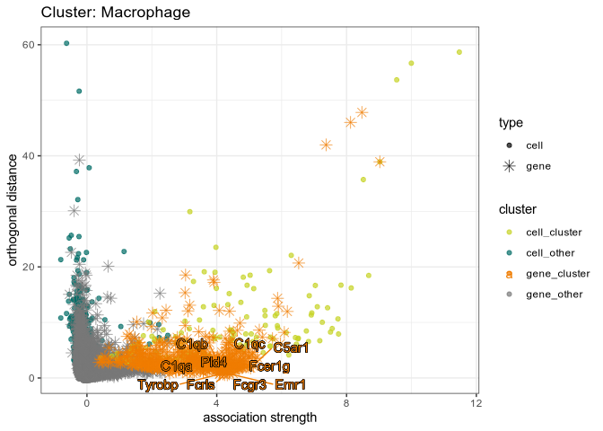
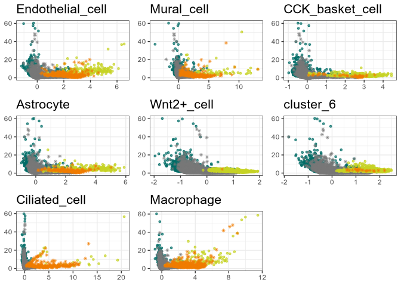
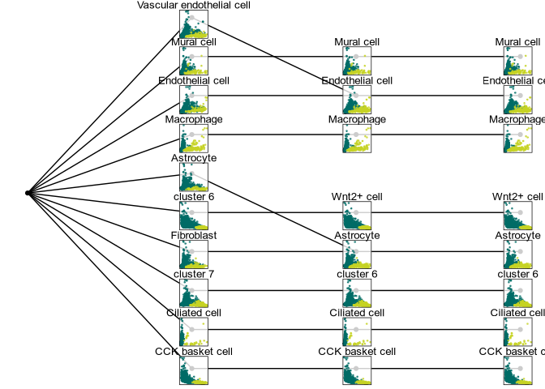

# Clustering by directions in CA space

This package implements a clustering algorithms that determines clusters
iteratively by their directions in CA space. Unlike most other
algorithms it does not require prior knowledge of the number of clusters
in the data, but can instead infer them during clustering. The package
can be installed through GitHub:

::: cell
``` {.r .cell-code}
devtools::install_github("VingronLab/CAdir")
```
:::

Note that currently you have to also install CAbiNet from GitHub for the
package to function.

# Quick start

Download example data and perform basic preprocessing:

::: cell
``` {.r .cell-code}
suppressPackageStartupMessages({
  library(CAdir)
  library(APL)

  # packages for loading the example:
  library(scRNAseq)
  library(scran)
  library(scater)
  library(scuttle)
})

set.seed(2358)

sce <- scRNAseq::ZeiselBrainData()
clust <- scran::quickCluster(sce)
sce <- scran::computeSumFactors(sce, cluster = clust, min.mean = 0.1)
sce <- scuttle::logNormCounts(sce)
dec <- scran::modelGeneVar(sce)
top_genes <- scran::getTopHVGs(dec, prop = 0.8)
sce <- sce[top_genes, ]
```
:::

## Correspondence analysis

::: cell
``` {.r .cell-code}
cnts <- as.matrix(logcounts(sce))

ca <- cacomp(
  obj = cnts,
  princ_coords = 3,
  dims = 30,
  top = nrow(cnts),
  residuals = "pearson"
)

cell_types <- sce$level1class
cat("Number of cell types:", length(unique(cell_types)), "\n")
```

::: {.cell-output .cell-output-stdout}
    Number of cell types: 7 
:::
:::

## CAdir

::: cell
``` {.r .cell-code}
cadir <- dirclust_splitmerge(
  caobj = ca,
  k = 10,
  cutoff = NULL,
  min_cells = 20,
)
```

::: {.cell-output .cell-output-stderr}

    Inferred cutoff angle: 66.82
:::

::: {.cell-output .cell-output-stderr}
    Iteration 1
        Merging cluster_1 with cluster_9
        Merging cluster_4 with cluster_5
    Iteration 2
:::

``` {.r .cell-code}
cadir
```

::: {.cell-output .cell-output-stdout}
    cadir object with 3005 cells and 1518 genes.
    8 clusters found.
    Clustering results:

     cluster   ncells ngenes
     cluster_1  221   364   
     cluster_2   92   233   
     cluster_3  312    44   
     cluster_4  242   148   
     cluster_5 1223     1   
     cluster_6  721    22   
     cluster_7   37   215   
     cluster_8  157   491   
:::
:::

Annotate cell clusters:

::: cell
``` {.r .cell-code}
cadir <- annotate_biclusters(
  obj = cadir,
  universe = rownames(sce),
  org = "mm"
)
cadir
```

::: {.cell-output .cell-output-stdout}
    cadir object with 3005 cells and 1518 genes.
    8 clusters found.
    Clustering results:

     cluster          ncells ngenes
     Endothelial_cell  221   364   
     Mural_cell         92   233   
     CCK_basket_cell   312    44   
     Astrocyte         242   148   
     Wnt2+_cell       1223     1   
     cluster_6         721    22   
     Ciliated_cell      37   215   
     Macrophage        157   491   
:::
:::

Rank cluster specific genes:

::: cell
``` {.r .cell-code}
cadir <- rank_genes(cadir = cadir, caobj = ca)
top <- top_genes(cadir)

# Top genes for cluster Macrophage
head(top[top$Cluster == "Macrophage", ])
```

::: {.cell-output .cell-output-stdout}
                      Rowname    Score Row_num    Cluster
    Macrophage.Fcgr3    Fcgr3 3.360433      14 Macrophage
    Macrophage.Fcer1g  Fcer1g 3.357104      31 Macrophage
    Macrophage.Fcrls    Fcrls 3.315777      15 Macrophage
    Macrophage.Emr1      Emr1 3.263846      52 Macrophage
    Macrophage.C1qc      C1qc 3.146628      24 Macrophage
    Macrophage.Tyrobp  Tyrobp 3.144369      10 Macrophage
:::
:::

## Plot results

::: cell
``` {.r .cell-code}
cluster_apl(
  cadir = cadir,
  caobj = ca,
  direction = cadir@directions["Macrophage", ],
  group = which(cadir@cell_clusters == "Macrophage"),
  cluster = "Macrophage",
  show_genes = TRUE,
  label_genes = TRUE
)
```

::: cell-output-display

:::
:::

::: cell
``` {.r .cell-code}
plot_clusters(
  cadir = cadir,
  caobj = ca,
  show_genes = TRUE,
  title_prefix = "",
  axis = TRUE
)
```

::: cell-output-display

:::
:::

::: cell
``` {.r .cell-code}
sm_plot(
  cadir = cadir,
  caobj = ca,
  show_genes = FALSE,
  show_cells = TRUE,
  annotate_clusters = TRUE,
  highlight_cluster = TRUE,
  org = "mm"
)
```

::: cell-output-display

:::
:::

# Package settings

Verbosity of the messages can be controlled with rlang. To turn all
messages off:

::: cell
``` {.r .cell-code}
options(rlib_message_verbosity = "quiet")
```
:::

To turn them back on:

::: cell
``` {.r .cell-code}
options(rlib_message_verbosity = "default")
```
:::
