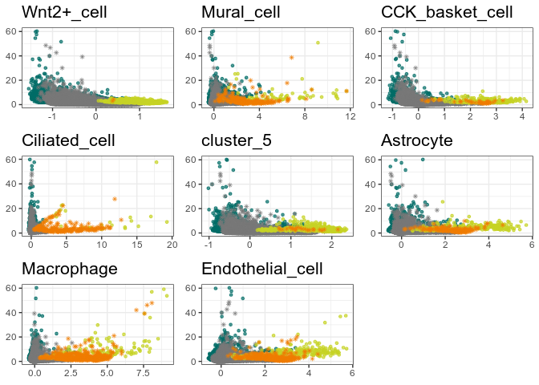

# README


# Clustering by directions in CA space

This package implements a clustering algorithms that determines clusters
iteratively by their directions in CA space. Unlike most other
algorithms it does not require prior knowledge of the number of clusters
in the data, but can instead infer them during clustering. The package
can be installed through GitHub:

``` r
devtools::install_github("ClemensKohl/CAdir")
```

    Skipping install of 'CAdir' from a github remote, the SHA1 (7528e640) has not changed since last install.
      Use `force = TRUE` to force installation

Note that currently you have to also install CAbiNet from GitHub for the
package to function.

# Quick start

Download example data and perform basic preprocessing:

``` r
devtools::load_all("~/gits/ClemensKohl/CAdir/")
```

    ℹ Loading CAdir

    Warning: multiple methods tables found for 'acbind'

    Warning: multiple methods tables found for 'arbind'

    Warning: replacing previous import 'utils::findMatches' by
    'S4Vectors::findMatches' when loading 'AnnotationDbi'

``` r
library(APL)

# packages for loading the example:
library(scRNAseq)
```

    Loading required package: SingleCellExperiment
    Loading required package: SummarizedExperiment
    Loading required package: MatrixGenerics
    Loading required package: matrixStats

    Attaching package: 'MatrixGenerics'

    The following objects are masked from 'package:matrixStats':

        colAlls, colAnyNAs, colAnys, colAvgsPerRowSet, colCollapse,
        colCounts, colCummaxs, colCummins, colCumprods, colCumsums,
        colDiffs, colIQRDiffs, colIQRs, colLogSumExps, colMadDiffs,
        colMads, colMaxs, colMeans2, colMedians, colMins, colOrderStats,
        colProds, colQuantiles, colRanges, colRanks, colSdDiffs, colSds,
        colSums2, colTabulates, colVarDiffs, colVars, colWeightedMads,
        colWeightedMeans, colWeightedMedians, colWeightedSds,
        colWeightedVars, rowAlls, rowAnyNAs, rowAnys, rowAvgsPerColSet,
        rowCollapse, rowCounts, rowCummaxs, rowCummins, rowCumprods,
        rowCumsums, rowDiffs, rowIQRDiffs, rowIQRs, rowLogSumExps,
        rowMadDiffs, rowMads, rowMaxs, rowMeans2, rowMedians, rowMins,
        rowOrderStats, rowProds, rowQuantiles, rowRanges, rowRanks,
        rowSdDiffs, rowSds, rowSums2, rowTabulates, rowVarDiffs, rowVars,
        rowWeightedMads, rowWeightedMeans, rowWeightedMedians,
        rowWeightedSds, rowWeightedVars

    Loading required package: GenomicRanges
    Loading required package: stats4
    Loading required package: BiocGenerics

    Attaching package: 'BiocGenerics'

    The following objects are masked from 'package:stats':

        IQR, mad, sd, var, xtabs

    The following objects are masked from 'package:base':

        Filter, Find, Map, Position, Reduce, anyDuplicated, aperm, append,
        as.data.frame, basename, cbind, colnames, dirname, do.call,
        duplicated, eval, evalq, get, grep, grepl, intersect, is.unsorted,
        lapply, mapply, match, mget, order, paste, pmax, pmax.int, pmin,
        pmin.int, rank, rbind, rownames, sapply, setdiff, table, tapply,
        union, unique, unsplit, which.max, which.min

    Loading required package: S4Vectors

    Attaching package: 'S4Vectors'

    The following object is masked from 'package:utils':

        findMatches

    The following objects are masked from 'package:base':

        I, expand.grid, unname

    Loading required package: IRanges
    Loading required package: GenomeInfoDb
    Loading required package: Biobase
    Welcome to Bioconductor

        Vignettes contain introductory material; view with
        'browseVignettes()'. To cite Bioconductor, see
        'citation("Biobase")', and for packages 'citation("pkgname")'.


    Attaching package: 'Biobase'

    The following object is masked from 'package:MatrixGenerics':

        rowMedians

    The following objects are masked from 'package:matrixStats':

        anyMissing, rowMedians

    Warning: replacing previous import 'S4Arrays::makeNindexFromArrayViewport' by
    'DelayedArray::makeNindexFromArrayViewport' when loading 'HDF5Array'

``` r
library(scran)
```

    Loading required package: scuttle

``` r
library(scater)
```

    Loading required package: ggplot2

``` r
library(scuttle)

set.seed(2358)

sce <- scRNAseq::ZeiselBrainData()
clust <- scran::quickCluster(sce)
sce <- scran::computeSumFactors(sce, cluster = clust, min.mean = 0.1)
sce <- scuttle::logNormCounts(sce)
dec <- scran::modelGeneVar(sce)
top_genes <- scran::getTopHVGs(dec, prop = 0.8)
sce <- sce[top_genes, ]
```

## Correspondence analysis

``` r
cnts <- as.matrix(logcounts(sce))

ca <- cacomp(obj = cnts,
             princ_coords = 3,
             dims = 30,
             top = nrow(cnts),
             residuals = "pearson",
             python = TRUE)

cell_types <- sce$level1class
cat("Number of cell types:", length(unique(cell_types)), "\n")
```

    Number of cell types: 7 

## CAdir

``` r
cadir <- dirclust_splitmerge(
  caobj = ca,
  k = 10,
  cutoff = NULL,
  min_cells = 20,
)
```


    Inferred cutoff angle: 66.85

    Iteration 1
        Merging cluster_1 with cluster_4
    •   Merging cluster_1 with cluster_9
    Iteration 2
    Iteration 3
    Iteration 4
    Iteration 5

``` r
cadir
```

    caclust object with 3005 cells and 1518 genes.
    8 clusters found.
    Clustering results:

     cluster   ncells ngenes
     cluster_1 1225     2   
     cluster_2   92   233   
     cluster_3  310    43   
     cluster_4   37   215   
     cluster_5  721    22   
     cluster_6  242   148   
     cluster_7  157   491   
     cluster_8  221   364   

Annotate cell clusters:

``` r
cadir <- annotate_biclustering(
  obj = cadir,
  universe = rownames(sce),
  org = "mm"
)
cadir
```

    caclust object with 3005 cells and 1518 genes.
    8 clusters found.
    Clustering results:

     cluster          ncells ngenes
     Wnt2+_cell       1225     2   
     Mural_cell         92   233   
     CCK_basket_cell   310    43   
     Ciliated_cell      37   215   
     cluster_5         721    22   
     Astrocyte         242   148   
     Macrophage        157   491   
     Endothelial_cell  221   364   

Rank cluster specific genes:

``` r
cadir <- rank_genes(cadir = cadir, caobj = ca)
top <- top_genes(cadir)

# Top genes for cluster Macrophage
head(top[top$Cluster == "Macrophage", ])
```

                      Rowname    Score Row_num    Cluster
    Macrophage.Fcgr3    Fcgr3 3.345201      14 Macrophage
    Macrophage.Fcer1g  Fcer1g 3.338749      31 Macrophage
    Macrophage.Fcrls    Fcrls 3.301021      15 Macrophage
    Macrophage.Emr1      Emr1 3.246037      52 Macrophage
    Macrophage.Tyrobp  Tyrobp 3.129216      10 Macrophage
    Macrophage.C1qc      C1qc 3.126874      24 Macrophage

## Plot results

``` r
cluster_apl(cadir = cadir,
            caobj = ca,
            direction = cadir@directions["Macrophage",],
            group = which(cadir@cell_clusters == "Macrophage"),
            cluster = "Macrophage",
            show_genes = TRUE,
            label_genes = TRUE)
```


``` r
plot_clusters(
  cadir = cadir,
  caobj = ca,
  show_genes = TRUE,
  label_genes = TRUE,
  ntop = 5,
  title_prefix = "",
  axis = TRUE
)
```



``` r
sm_plot(
  cadir = cadir,
  caobj = ca,
  show_genes = FALSE,
  show_cells = TRUE,
  annotate_clusters = TRUE,
  highlight_cluster = TRUE,
  org = "mm"
)
```


# Package settings

Verbosity of the messages can be controlled with rlang. To turn all
messages off:

``` r
rlang::local_options(mypackage.verbose = "quiet")
```

To turn them back on:

``` r
rlang::local_options(mypackage.verbose = "verbose")
```
